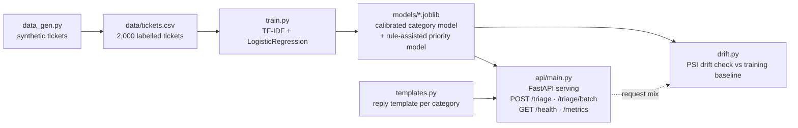

# ticket-triage 🎫🤖

**AI customer-support ticket triage service.** Paste in a support ticket and get back:
(a) the predicted category, (b) a calibrated confidence score, (c) a priority level
(low / medium / high / urgent), and (d) a suggested auto-reply for that category —
via a FastAPI service with a drift monitor watching production traffic.

## The problem

Support teams drown in tickets. Every ticket that gets misrouted or sits in the
wrong queue is a blown SLA, an angry customer, and an agent context-switching to
fix someone else's routing. `ticket-triage` puts a fast ML first-pass in front of
the queue: classify, prioritise, and draft the reply — so humans start from a
sensible draft instead of a blank inbox.

## Architecture



## How it works

- **Data** (`src/data_gen.py`): generates 2,000 realistic support tickets with a
  seeded RNG (reproducible) across 8 categories — billing, technical, account,
  delivery, returns, product_info, complaint, feedback — each with a priority
  label. Varied, slot-filled templates (names, amounts, order numbers, error
  codes), not one sentence per class.
- **Training** (`src/train.py`): TF-IDF (word + bigrams) features.
  - *Category classifier*: LogisticRegression wrapped in
    `CalibratedClassifierCV` (sigmoid, 3-fold) so the confidence scores mean
    something.
  - *Priority scorer*: TF-IDF + LogisticRegression, with rule-based urgency
    signals (e.g. "charged twice", "site is down", "formal complaint") blended
    in as extra features.
  - Stratified 80/20 split; prints a full classification report; saves
    `models/metrics.json` with the honest numbers from that run.
- **Serving** (`api/main.py`): FastAPI. `POST /triage` takes `{"text": ...}` and
  returns category, confidence, priority, and suggested reply. Also
  `POST /triage/batch`, `GET /health`, and `GET /metrics` (served metrics +
  a live drift verdict computed over the categories seen so far).
- **Drift** (`src/drift.py`): CLI that predicts categories for a new batch CSV
  and compares the distribution to the training baseline with the Population
  Stability Index. PSI < 0.1 → stable, < 0.25 → monitor, ≥ 0.25 → investigate /
  retrain.

## Quickstart

```bash
python -m venv .venv && source .venv/bin/activate
pip install -r requirements.txt

# 1. generate data
python src/data_gen.py --n 2000 --seed 42

# 2. train (prints classification reports, saves models + metrics.json)
python src/train.py

# 3. run the API
uvicorn api.main:app --reload

# 4. run tests
pytest tests/

# 5. drift check on a new batch
python src/drift.py --batch data/new_tickets.csv

# docker
docker build -t ticket-triage .
docker run -p 8000:8000 ticket-triage
```

## Example

```bash
curl -X POST http://localhost:8000/triage \
  -H 'Content-Type: application/json' \
  -d '{"text": "I was charged twice on my Visa ending 4412 this month, invoice INV-48291. Please refund the duplicate charge."}'
```

Real response from a live run:

```json
{
  "category": "billing",
  "confidence": 0.9887,
  "priority": "urgent",
  "suggested_reply": "Thanks for getting in touch about your billing. I've pulled up your account and I'm looking into the charge now. I'll confirm the amount and next steps within one business day — if anything needs refunding, I'll process it right away."
}
```

Batch triage also works:

```bash
curl -X POST http://localhost:8000/triage/batch \
  -H 'Content-Type: application/json' \
  -d '{"texts": ["The app crashes every time I open the reports tab on iOS.", "Just wanted to say the new dashboard is fantastic, great work!"]}'
```
→ `technical` / high and `feedback` / low, each with its own suggested reply.

## Metrics (from the actual training run)

1,600 train / 400 test, stratified, seed 42. Saved in `models/metrics.json`.

| Model | Accuracy | Macro-F1 | Mean confidence |
|---|---|---|---|
| Category classifier (calibrated LR) | **1.0000** | **1.0000** | 0.9833 |
| Priority scorer (rule-assisted LR) | **1.0000** | **1.0000** | — |

Per-class F1 (test set, n=400):

| Category | F1 | Support | Priority | F1 | Support |
|---|---|---|---|---|---|
| account | 1.000 | 49 | low | 1.000 | 140 |
| billing | 1.000 | 49 | medium | 1.000 | 104 |
| complaint | 1.000 | 50 | high | 1.000 | 116 |
| delivery | 1.000 | 49 | urgent | 1.000 | 40 |
| feedback | 1.000 | 47 | | | |
| product_info | 1.000 | 49 | | | |
| returns | 1.000 | 53 | | | |
| technical | 1.000 | 54 | | | |

Drift check on a fresh 300-ticket batch: PSI **0.0157** → no significant drift.
On a deliberately billing-skewed batch: PSI **10.0771** → significant drift
(the monitor catches real distribution shifts).

> **A note on the perfect scores:** the dataset is synthetic — 80 varied
> templates with strong lexical signals per class, so the classes are highly
> separable. These numbers validate the pipeline end-to-end (data → training →
> serving → drift), not a claim about real-world ticket performance. On messy
> real tickets expect lower scores — which is exactly why the drift monitor
> exists.

## Project structure

```
ticket-triage/
├── src/
│   ├── data_gen.py      # seeded synthetic ticket generator (8 categories)
│   ├── train.py         # calibrated category + rule-assisted priority models
│   ├── drift.py         # PSI drift-check CLI vs training baseline
│   └── templates.py     # auto-reply template per category
├── api/
│   └── main.py          # FastAPI: /triage, /triage/batch, /health, /metrics
├── tests/
│   └── test_pipeline.py # data-gen, training, API (TestClient), PSI tests
├── data/tickets.csv     # generated dataset (2,000 tickets)
├── models/              # trained artifacts: *.joblib, metrics.json, baseline_distribution.json
├── requirements.txt
├── Dockerfile
└── README.md
```

## Limitations & future work

- Synthetic data: great for a reproducible demo, no substitute for real tickets.
- Priority rules are hand-written patterns — a production version would learn
  these from labelled data and agent feedback.
- No multilingual support; TF-IDF won't catch paraphrases a transformer would.
- Next steps: swap TF-IDF for a small sentence-embedding model, add a feedback
  loop (`POST /triage/feedback`) to collect corrections for retraining, and
  persist drift history to a database instead of in-memory request counts.

---
Built with scikit-learn, FastAPI and a healthy respect for support agents everywhere.
